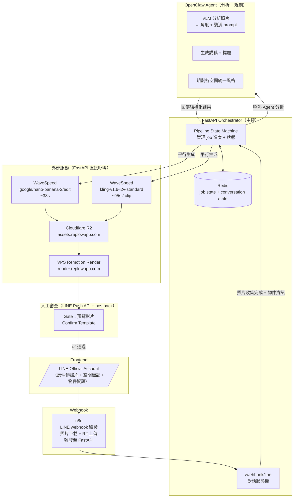

# ReelEstate 系統架構

> 最後更新：2026-03-19

## 架構圖



## 職責分工

### FastAPI Orchestrator
- 接收 n8n 轉發的 LINE webhook events
- 管理對話狀態機（`/webhook/line`）：照片收集 → 空間標記 → 物件資訊
- 管理 job state（存 Redis）
- **呼叫 Agent** 做所有需要「思考」的任務
- **直接呼叫** 所有外部 API（WaveSpeed、VPS）
- 管理 Gate 審查（LINE Push API 推送 Confirm Template，等 postback）
- 輪詢非同步 job 結果（WaveSpeed、VPS）

### OpenClaw Agent（短 context，一次一任務）
| 任務 | 輸入 | 輸出 |
|------|------|------|
| 分析照片 | 各空間照片 URL + 是否高階方案 | 每空間：裝潢 prompt |
| 生成講稿 | 物件表單資料 | 帶 section marker 的旁白 + 標題 |
| 生成 input.json 草稿 | 表單 + 空間清單 | Remotion input.json |

### n8n
- 接收 LINE Messaging API webhook
- 驗證 `x-line-signature`（HMAC-SHA256）
- 下載照片 binary → 上傳 R2 → 取得 R2 URL
- 轉發 events（含 photo_url）至 FastAPI `/webhook/line`
- 未來：用戶管理、付費狀態、用量追蹤

## Pipeline 流程

| 步驟 | 執行者 | 動作 |
|------|--------|------|
| ① | LINE → n8n → FastAPI | 對話狀態機收集照片 + 空間標記 + 物件資訊 |
| ② | FastAPI → Agent | 分析照片（VLM）+ 生成講稿 |
| ③ | FastAPI → WaveSpeed（平行） | 虛擬裝潢 + Kling 影片 |
| ④ | FastAPI → R2 | 上傳所有素材 |
| ⑤ | FastAPI → VPS | POST /render，輪詢結果 |
| ⑥ | FastAPI → LINE | **Gate**：推預覽影片 + Confirm Template，等 postback |
| ⑦ | FastAPI → LINE | 送出最終 MP4 |

## Job State（Redis）

```
job:{id}:
  status: analyzing | generating | rendering | gate_preview | delivering | done | failed
  raw_text: str            ← 物件資訊原始文字
  spaces_input: [...]      ← 空間清單（label + photos）
  agent_result: { ... }    ← Agent 回傳的分析結果
  clip_urls: [...]         ← Kling 影片 URL
  staging_urls: { ... }    ← 裝潢圖 URL map
  preview_url: str         ← 預覽 MP4 URL
  thumbnail_url: str       ← 預覽縮圖 URL（LINE video message 用）
  final_url: str           ← 最終 MP4 URL

conv:{line_user_id}:
  state: idle | collecting | awaiting_label | awaiting_info | processing | awaiting_feedback
  pending_photos: [...]    ← 當前批次的照片 URL
  spaces: [...]            ← 已標記的空間
  exterior_photo: str      ← 外觀照片 URL
  job_id: str              ← 對應的 pipeline job ID
```

## 服務清單

| 服務 | Endpoint | 認證 |
|------|----------|------|
| LINE Messaging API | `https://api.line.me/v2/bot/message/push` | `Bearer <channel_access_token>` |
| WaveSpeed API | `https://api.wavespeed.ai/api/v3/` | `Bearer <key>` |
| VPS Render | `https://render.replowapp.com` | `Bearer reelestate-render-token-2024` |
| R2 Proxy | `reelestate-r2-proxy.beingzackhsu.workers.dev` | `X-Upload-Token` |
| R2 CDN | `assets.replowapp.com` | 公開讀取 |

## 目錄結構

```
ReelEstate/
├── orchestrator/          ← FastAPI Orchestrator
│   ├── main.py
│   ├── pipeline/
│   │   ├── state.py       ← Redis job state
│   │   ├── jobs.py        ← pipeline 步驟邏輯
│   │   └── gates.py       ← Gate 審查邏輯
│   ├── services/
│   │   ├── agent.py       ← 呼叫 OpenClaw Agent
│   │   ├── wavespeed.py   ← WaveSpeed API wrapper
│   │   ├── render.py      ← VPS render wrapper
│   │   └── r2.py          ← R2 上傳 wrapper
│   ├── line/
│   │   ├── bot.py         ← LINE Push API client
│   │   ├── conversation.py ← 對話狀態機（Redis-backed）
│   │   └── webhook.py     ← /webhook/line endpoint
│   └── tests/
│       ├── test_line_bot.py
│       ├── test_conversation.py
│       └── test_line_webhook.py
├── remotion/              ← Remotion render server
└── agent/
    └── SKILL.md           ← OpenClaw Agent skill
```
