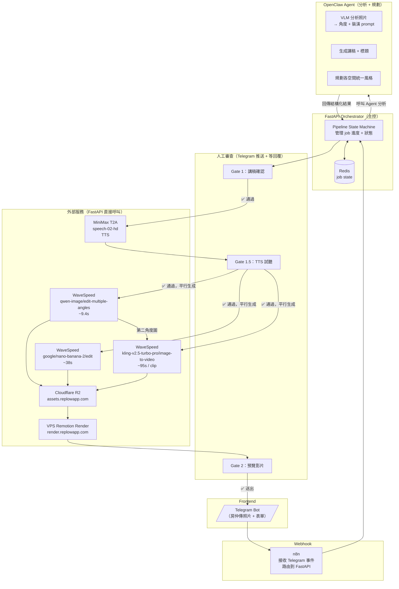

# ReelEstate 系統架構

> 最後更新：2026-03-19

## 架構圖



## 職責分工

### FastAPI Orchestrator
- 接收 n8n 傳來的 job
- 管理 job state（存 Redis）
- **呼叫 Agent** 做所有需要「思考」的任務
- **直接呼叫** 所有外部 API（WaveSpeed、MiniMax、VPS）
- 管理 Gate 審查（推 Telegram，等 callback 再繼續）
- 輪詢非同步 job 結果（WaveSpeed、VPS）

### OpenClaw Agent（短 context，一次一任務）
| 任務 | 輸入 | 輸出 |
|------|------|------|
| 分析照片 | 各空間照片 URL + 是否高階方案 | 每空間：角度參數 + 裝潢 prompt |
| 生成講稿 | 物件表單資料 | 帶 section marker 的旁白 + 標題 |
| 生成 input.json 草稿 | 表單 + 空間清單 | Remotion input.json |

### n8n
- 接收 Telegram webhook（照片、表單訊息、Gate 回覆）
- 路由到 FastAPI 對應 endpoint

## Pipeline 流程

| 步驟 | 執行者 | 動作 |
|------|--------|------|
| ① | n8n | 接收表單 + 照片，呼叫 `POST /jobs` |
| ② | FastAPI → Agent | 分析照片（VLM）+ 生成講稿 |
| ③ | FastAPI → Telegram | **Gate 1**：推講稿，等房仲回覆 |
| ④ | FastAPI → MiniMax T2A | MiniMax T2A API（同步 HTTP）|
| ⑤ | FastAPI → Telegram | **Gate 1.5**：推音訊試聽，等回覆 |
| ⑥ | FastAPI → WaveSpeed（平行） | 多角度生成 + 虛擬裝潢 + Kling 影片 |
| ⑦ | FastAPI → R2 | 上傳所有素材 |
| ⑧ | FastAPI → VPS | POST /render，輪詢結果 |
| ⑨ | FastAPI → Telegram | **Gate 2**：推預覽影片，等回覆 |
| ⑩ | FastAPI → Telegram | 送出最終 MP4 |

## Job State（Redis）

```
job:{id}:
  status: pending | analyzing | gate_1 | tts | gate_1.5 | generating | rendering | gate_2 | done | failed
  form: { ... }           ← 原始表單資料
  photos: { ... }         ← 照片 URL map（空間 → URL[]）
  agent_result: { ... }   ← Agent 回傳的分析結果
  narration_url: str      ← R2 URL
  captions: [...]         ← 字幕資料（若有）
  clip_urls: [...]        ← Kling 影片 URL
  staging_urls: { ... }   ← 裝潢圖 URL map
  render_job_id: str      ← VPS render job ID
  final_url: str          ← 最終 MP4 URL
```

## 服務清單

| 服務 | Endpoint | 認證 |
|------|----------|------|
| WaveSpeed API | `https://api.wavespeed.ai/api/v3/` | `Bearer <key>` |
| MiniMax T2A | MiniMax API | API key |
| VPS Render | `https://render.replowapp.com` | `Bearer reelestate-render-token-2024` |
| R2 Proxy | `reelestate-r2-proxy.beingzackhsu.workers.dev` | `X-Upload-Token` |
| R2 CDN | `assets.replowapp.com` | 公開讀取 |

## 目錄結構

```
ReelEstate/
├── orchestrator/          ← FastAPI Orchestrator（新）
│   ├── main.py
│   ├── pipeline/
│   │   ├── state.py       ← Redis job state
│   │   ├── jobs.py        ← pipeline 步驟邏輯
│   │   └── gates.py       ← Gate 審查邏輯
│   ├── services/
│   │   ├── agent.py       ← 呼叫 OpenClaw Agent
│   │   ├── wavespeed.py   ← WaveSpeed API wrapper
│   │   ├── render.py      ← VPS render wrapper
│   │   └── r2.py          ← R2 上傳 wrapper
│   └── telegram/
│       ├── bot.py         ← Telegram bot（Gate 推送 + 等回覆）
│       └── webhook.py     ← n8n 傳來的 webhook handler
├── remotion/              ← Remotion render server（已完成）
└── agent/
    └── SKILL.md           ← OpenClaw Agent skill（分析 + 規劃）
```
