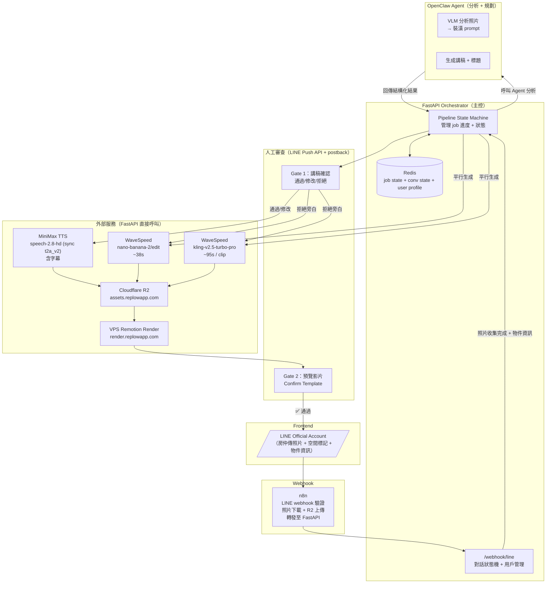

# ReelEstate 系統架構

> 最後更新：2026-03-21

## 架構圖



## 職責分工

### FastAPI Orchestrator
- 接收 n8n 轉發的 LINE webhook events
- **用戶管理**：新用戶註冊、配額扣除（UserStore / Redis Hash）
- 管理對話狀態機（`/webhook/line`）：照片收集 → 空間標記 → 物件資訊 → 風格/旁白選擇
- 管理 job state（存 Redis）
- 呼叫 Agent 做所有「思考」任務
- 直接呼叫所有外部 API（WaveSpeed、MiniMax、VPS）
- 管理 Gate 審查（LINE Push API + 等 postback）

### OpenClaw Agent
| 任務 | 輸入 | 輸出 |
|------|------|------|
| 整理物件資訊 | raw_text | 結構化 property JSON |
| 分析照片 | 各空間照片 URL | 裝潢 prompt |
| 生成講稿 | 物件資料 | 帶 section marker + `<#秒數#>` 停頓標記的旁白 |

### n8n
- 接收 LINE Messaging API webhook
- 驗證 `x-line-signature`（HMAC-SHA256）
- 下載照片 binary → 上傳 R2 → 取得 R2 URL
- 轉發 events（含 photo_url）至 FastAPI `/webhook/line`

## Pipeline 流程

| 步驟 | 執行者 | 動作 |
|------|--------|------|
| ① | LINE → n8n → FastAPI | 對話狀態機收集照片 + 空間標記 + 物件資訊 |
| ② | FastAPI → Agent | 分析照片（VLM）+ 生成講稿 |
| ③ | FastAPI → LINE（Gate 1） | 推講稿，等用戶確認/修改/拒絕（10 分鐘 timeout → 自動通過） |
| ④ | FastAPI → MiniMax | TTS 生成 narration.mp3 + subtitles.json（失敗降級） |
| ⑤ | FastAPI → WaveSpeed（平行） | 虛擬裝潢 + Kling 影片 |
| ⑥ | FastAPI → R2 | 上傳所有素材 |
| ⑦ | FastAPI → VPS | POST /render，輪詢結果 |
| ⑧ | FastAPI → LINE（Gate 2） | 推預覽影片 + Confirm Template，等 postback |
| ⑨ | FastAPI → LINE | 送出最終 MP4 |

## Job State（Redis）

```
job:{id}:
  status: analyzing | generating | rendering | gate_preview | delivering | done | failed
  raw_text: str
  spaces_input: [...]           ← 空間清單（label + photos）
  agent_result: { ... }         ← Agent 回傳的分析結果
  asset_tasks: { ... }          ← WaveSpeed 子任務狀態
  preview_url: str
  thumbnail_url: str
  final_url: str
  narration_enabled: bool       ← 用戶是否選擇旁白
  narration_text: str           ← Agent 生成的講稿
  narration_url: str            ← TTS 生成後上傳 R2 的 URL
  narration_subtitles: [...]    ← sentence-level 字幕（time_begin/time_end ms）
  narration_subtitles_url: str  ← 字幕 JSON 上傳 R2 的 URL
  chosen_style: str             ← 用戶選的裝潢風格
  errors: [...]

conv:{line_user_id}:
  state: idle | collecting | awaiting_label | awaiting_info | processing | awaiting_feedback
       | awaiting_reg_name | awaiting_reg_company | awaiting_reg_phone | awaiting_reg_line_id
       | choosing_style | awaiting_narration_choice | editing_narration
  pending_photos: [...]
  spaces: [...]
  exterior_photo: str
  job_id: str
  raw_text: str
  chosen_style: str
  narration_enabled: bool
  reg_name / reg_company / reg_phone: str   ← 暫存註冊資料

user:{line_user_id}:
  name, company, phone, line_id
  quota (int), usage (int), created_at

narration_gate:{job_id}:
  Gate 1 投票結果（approve / edit:{text} / reject）
```

## 服務清單

| 服務 | Endpoint | 認證 |
|------|----------|------|
| LINE Messaging API | `https://api.line.me/v2/bot/message/push` | `Bearer <channel_access_token>` |
| WaveSpeed API | `https://api.wavespeed.ai/api/v3/` | `Bearer <key>` |
| MiniMax TTS | `https://api.minimaxi.chat/v1/t2a_v2` (sync) | `Bearer <api_key>` + GroupId |
| VPS Render | `https://render.replowapp.com` | `Bearer reelestate-render-token-2024` |
| R2 Proxy | `reelestate-r2-proxy.beingzackhsu.workers.dev` | `X-Upload-Token` |
| R2 CDN | `assets.replowapp.com` | 公開讀取 |
| Mapbox | `api.mapbox.com` | token |
| Google Places | Google Cloud API | API key |

## 目錄結構

```
ReelEstate/
├── orchestrator/
│   ├── main.py                  ← FastAPI 入口 + lifespan（初始化所有服務）
│   ├── config.py                ← 環境變數（pydantic-settings）
│   ├── models.py                ← Pydantic 資料模型（JobState、UserProfile 等）
│   ├── pipeline/
│   │   ├── state.py             ← Redis job state CRUD
│   │   ├── jobs.py              ← pipeline 步驟邏輯（含 narration gate）
│   │   └── gates.py             ← Gate 2 預覽影片審查邏輯
│   ├── services/
│   │   ├── agent.py             ← 呼叫 OpenClaw Agent
│   │   ├── wavespeed.py         ← WaveSpeed API wrapper
│   │   ├── render.py            ← VPS render wrapper
│   │   ├── r2.py                ← R2 上傳 wrapper
│   │   └── minimax.py           ← MiniMax TTS wrapper（sync t2a_v2 + subtitle，aiohttp，semaphore(5)）
│   ├── stores/
│   │   └── user.py              ← UserStore（Redis Hash + Lua quota）
│   ├── line/
│   │   ├── bot.py               ← LINE Push API client
│   │   ├── conversation.py      ← 對話狀態機（Redis-backed）
│   │   ├── validators.py        ← 註冊欄位驗證
│   │   └── webhook.py           ← /webhook/line endpoint
│   ├── requirements.txt
│   └── tests/
│       ├── test_line_bot.py
│       ├── test_conversation.py
│       ├── test_line_webhook.py
│       ├── test_registration.py
│       ├── test_user_store.py
│       ├── test_validators.py
│       └── test_minimax.py
├── remotion/
│   ├── src/
│   │   ├── Root.tsx
│   │   ├── ReelEstateVideo.tsx  ← 主 composition + 轉場 + BGM/narration 音訊 + 字幕
│   │   ├── types.ts             ← VideoInput（含 narration + narrationSubtitles）
│   │   ├── components/
│   │   │   └── SubtitleOverlay.tsx ← 字幕 overlay（sentence-level，fade in/out）
│   │   └── compositions/
│   │       ├── OpeningScene.tsx
│   │       ├── ClipScene.tsx
│   │       ├── StagingScene.tsx
│   │       ├── StatsScene.tsx
│   │       ├── CTAScene.tsx
│   │       └── MapboxFlyIn.tsx
│   └── server/
│       ├── index.ts
│       ├── render-handler.ts
│       ├── renderer.ts
│       ├── assets.ts            ← 下載素材（含 narration）
│       ├── types.ts             ← RenderInput（含 narration + narrationSubtitles）
│       └── uploader.ts
└── agent/
    └── SKILL.md                 ← Claude Agent 系統提示詞
```
